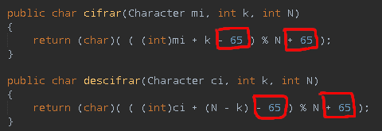
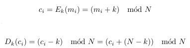

Cuando empecé a estudiar sobre criptografía hice una pequeña implementación del cifrado y descifrado de los llamados «cifrados clásicos», de esta forma se hace más divertido su estudio. En este repo está la implementación con ejemplos de ejecución en el readme.

## Cifrado de desplazamiento

Este cifrado consiste en desplazar las letras del alfabeto K posiciones, al final se trata como en los ejercicios que hice en el colegio: «si han pasado 56 horas, ¿Qué hora es para un reloj de pared?» lo que podría escribir para nuestro cifrado como «si han pasado 56 posiciones, ¿Qué posición (letra) le corresponde?», pero en vez de hacer sucesivas restas de 12 horas se calcula la operación módulo. En la siguiente tabla la imagen de la izquierda corresponde a la implementación en Java y a la derecha las fórmulas para cifrar y descifrar:

En cuanto a los detalles de la implementación la codificación para las letras es ASCII, dado que el texto se sanea a mayúsculas el rango de valores a tener en cuenta es de 65 (A) hasta 90 (Z). Por tanto en el código antes de calcular el módulo hago que el valor del carácter comience en cero, restando el valor numérico de la letra ‘A’ (65) para posteriormente recuperar la codificación ASCII sumando el 65.

El el resultado obtenido es:

## Criptoanálisis por análisis de frecuencias

En cuanto a los detalles de la implementación la codificación para las letras es ASCII, dado que el texto se sanea a mayúsculas el rango de valores a tener en cuenta es de 65 (A) hasta 90 (Z). Por tanto en el código antes de calcular el módulo hago que el valor del carácter comience en cero, restando el valor numé

# Cifrado de Vigenère

## Implementación

## Criptoanálisis por análisis de frecuencias 

# Bibliografía