Cuando empecé a estudiar sobre criptografía hice una pequeña implementación del cifrado y descifrado de los llamados «cifrados clásicos», de esta forma se hace más divertido su estudio. En este repo está la implementación con ejemplos de ejecución en el readme.

## Cifrado de desplazamiento

Este cifrado consiste en desplazar las letras del alfabeto K posiciones, al final se trata como en los ejercicios que hice en el colegio: «si han pasado 56 horas, ¿Qué hora es para un reloj de pared?» lo que podría escribir para nuestro cifrado como «si han pasado 56 posiciones, ¿Qué posición (letra) le corresponde?», pero en vez de hacer sucesivas restas de 12 horas se calcula la operación módulo. En la siguiente tabla la imagen de la izquierda corresponde a la implementación en Java y a la derecha las fórmulas para cifrar y descifrar:

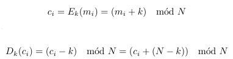

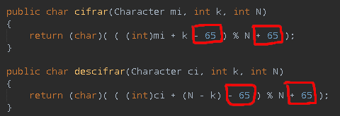

En cuanto a los detalles de la implementación la codificación para las letras es ASCII, dado que el texto se sanea a mayúsculas el rango de valores a tener en cuenta es de 65 (A) hasta 90 (Z). Por tanto en el código antes de calcular el módulo hago que el valor del carácter comience en cero, restando el valor numérico de la letra ‘A’ (65) para posteriormente recuperar la codificación ASCII sumando el 65.

El el resultado obtenido es:

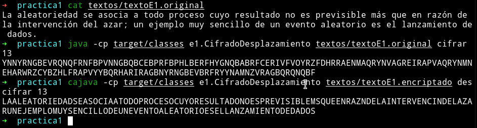

## Cifrado de Vigenère

Vigenère consiste en ‘t’ cifrados de desplazamiento de forma que los desplazamientos los define una clave ‘k’. La implementación es la misma al del cifrado por desplazamiento pero necesitando programar el bucle que itera la clave sobre el mensaje:

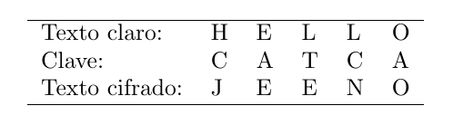

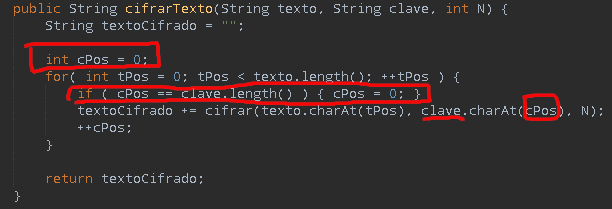

En el código mostrado en la imagen de la izquierda se usa la variables ‘cPos’ (clave posición) para que dado el momento donde la clave no tenga más caracteres respecto al mensaje el contador de esta se ponga a cero. Respecto a las funciones de cifrado y descifrado uso las del cifrado por desplazamiento:

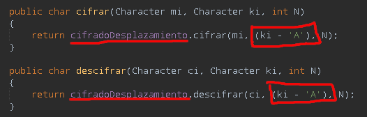

Para la implementación del cifrado por desplazamiento ‘k’ ya indica el valor desplazar, como en vigenère el desplazamiento depende de un caracter dado por la clave ese caracter hay que decodificarlo para obtenerlo en el rango [0, 25] tal como se ha explicado anteriormente.

Finalizando muestro el resultado obtenido:

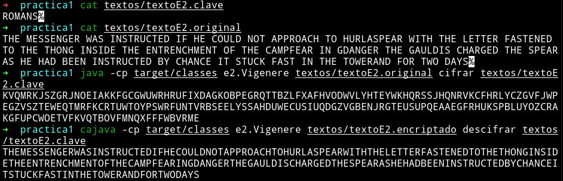

## Criptoanálisis del cifrado de desplazamiento por análisis de frecuencias

El análsis de frecuencias consiste en calcular la frecuencia de las letras que aparecen en el mensaje cifrado y compararla con la del idioma del mensaje, de forma que si en el mensaje cifrado la letra ‘X’ tiene una frecuencia muy similar a la ‘E’ del idioma de origen problablemente ‘X’ represente la letra ‘E’. En cuanto a la implementación:

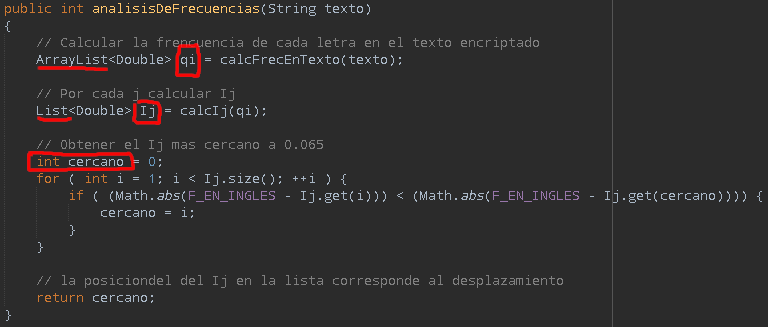

En cuanto al Ij el método es el siguiente:

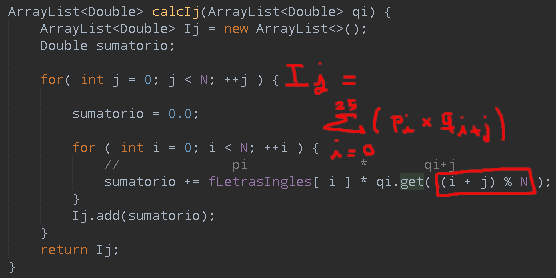

El bucle exterior selecciona la Ij a calcular y el interior opera el sumatorio, a la hora de obtener la suma (i + j) le aplico el módulo N (siendo N = 26) para no sobrepasar el rango de las listas y que el programa pare por dicho error. A excepción del uso del módulo la implementación corresponde a la fórmula explicada en la tarea. Finalizando muestro el resultado obtenido:

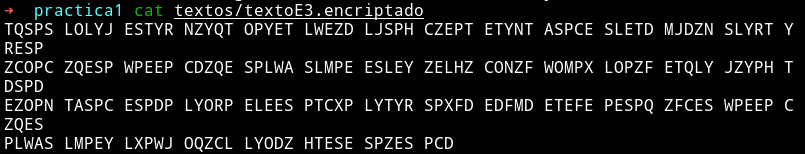

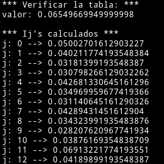 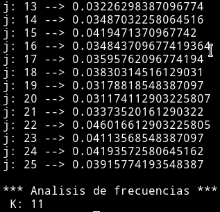

Dado que el desplazamiento K = 11, hago uso del código cifrado por desplazamiento para ver si es correcto:

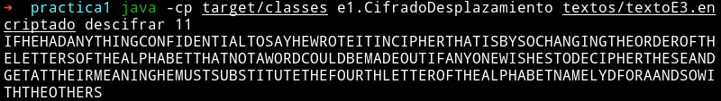

## Criptoanálisis del cifrado de Vigenère por análisis de frecuencias 

Hago uso del Índice de Coincidencia (IC), que es la probabilidad de que dos letras seleccionadas de forma aleatoria sean iguales.

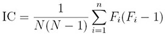

Además el IC puede usarse para estimar la longitud de una clave no conocida. Se calcula con el fin de obtener la longitud ‘l’ y dividir el texto cifrado en ‘l’ substrings.

El cálculo del substring es S = Cl * C2l * C3l * C4l…, lo que causa dividir el texto en columnas de longitud ‘l’. Si se obtiene la ‘l’ correctamente, cada substring resultante estará encriptado con la misma letra lo que permite atacar cada substring como una análisis de frecuencias monoalfabético. Dado el texto cifrado de 28 caracteres: RSTCS JLSLR SLFEL GWLFI ISIKR MGL El cálculo de los IC’s para cada ‘l’ da los siguientes valores:

| Longitud | IC's                           | Media  |
|----------|--------------------------------|--------|
| 2        | 0.0769, 0.0659                 | 0.0714 |
| 3        | 0.1111, 0.1944, 0.1667         | 0.1574 |
| 4        | 0.0476, 0.0476, 0.0476, 0.0476 | 0.0476 |

La media más cercana a 0.065 nos indica que el texto está encriptado con una clave de longitud 3. Durante el cálculo de ‘t’, como he explicado antes, se obtienen los ICs en función de ‘t’, la implementación de la fórmula de IC es la siguiente:

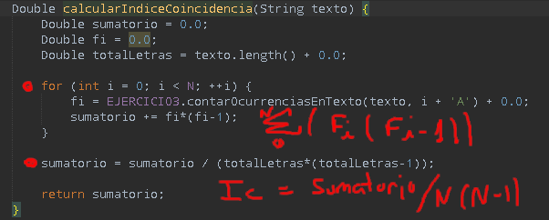

En la fórmula de la IC ‘Fi’ es el número de ocurrencias de la letra ‘i’ en el texto, ese código lo he reutilizado del codigo anterior. Finalizando el ejercicio muestro el resultado obtenido:

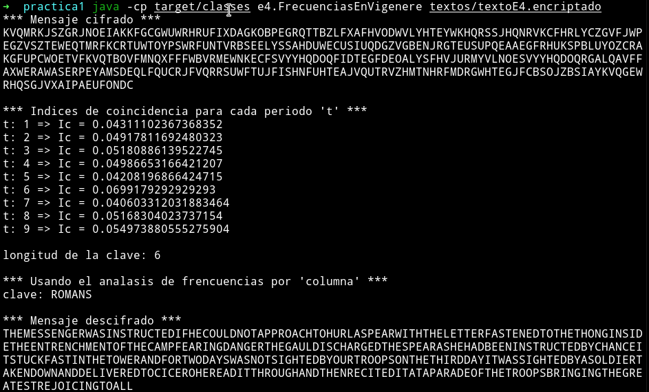

## Bibliografía

   * https://pages.mtu.edu/~shene/NSF-4/Tutorial/VIG/Vig-IOC.html
   * https://pages.mtu.edu/~shene/NSF-4/Tutorial/VIG/Vig-IOC-Len.html
   * https://www.dcode.fr/index-coincidence
