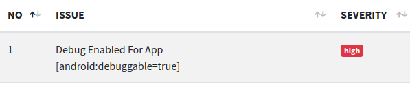

+++
author = "Hugo Authors"
title = "DIVA – Análisis dinámico (1/3)"
date = "2021-05-13"
description = ""
categories = [
    "android reversing"
]
tags = [
    "android reversing",
]
+++

DIVA es una app de Android diseñada para ser insegura, el código de la app se encuentra en el siguiente repo https://github.com/payatu/diva-android. Dentro de la app hay trece retos representando cada uno de ellos un tipo de error. La idea es simular el análisis de una app desde el uso de herramientas automatizadas para obtener una idea general a realizar el análisis estático. Creo que lo separaré en tres partes, la primera con las herramientas automáticas y otras dos partes resolviendo los retos.

## Vista rápida al análisis estático

Es interesante un vistazo rápido al que realiza MobSF porque puede dar información de posibles errores a ver en el dinámico.

Hay que tener en cuenta archivos generados durante la ejecución por los permisos de escritura y lectura en la sdcard. Además en la sección “code” ya nos avisa que se crean archivos temporales y bases de datos.

En cuanto al **androidmanifest.xml** la depuración está activada y una actividad accesible desde cualquier aplicación.

## Análisis dinámico

En **“Scan Options”** inicio el menú del análisis dinámico.

Inicio la sincronización con el botón **“Start Instrumentation”** y compruebo el log en **“Dinamic Analyzer”**.

Para acabar la “configuración” muestro la pantalla desde “Show screen”

Ahora ejecuto los distintos análisis y genero el reporte.

En la exported activities muestra la solución para el ejercicio **“10. Acces Control Issues – Parte 2”**

 

En cuanto a los archivos generados ha encontrado varias bases de datos y un xml.

 

De los archivos listados se encuentran usuarios y contraseñas.

También notas que parecen ser tomadas desde esa vista **“Diva private Notes”**.

