+++
author = "Hugo Authors"
title = "DIVA – Retos 1 al 5 (2/3)"
date = "2021-05-16"
description = "DIVA – Retos 1 al 5 (2/3)"
categories = [
    "Test"
]
tags = [
    "emoji",
]
+++

## Insecure logging

Al escribir una tarjeta de crédito inválida se muestra el mensaje “An error occurred. Please try again later”, este string se puede buscar en el código de la aplicación.

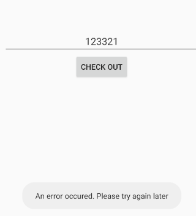

Entro a jadx y desde la “lupa” hago la búsqueda del string:

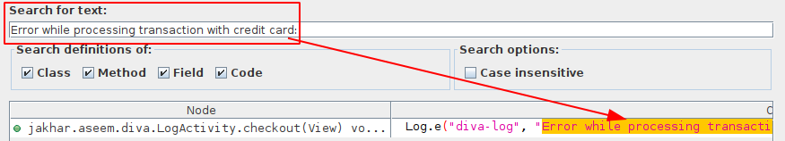

Dentro de la función que contiene el string se llama a “processCC()” lanzando una excepción que una vez recogida se escribe un log el cual contiene los datos introducidos.

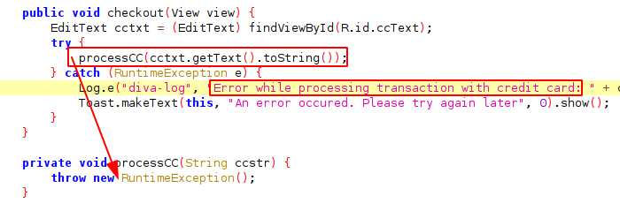

Desde una terminal con el comando “adb logcat” se ve el log con la tarjeta “123123”.

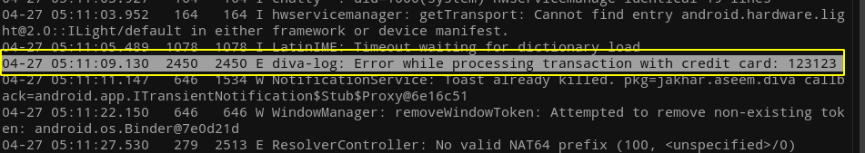

## Hardcoding Issues – Part 1

Igual al ejercicio anterior al introducir un valor incorrecto muestra un mensaje de error: “Access denied! See you in hell :D”

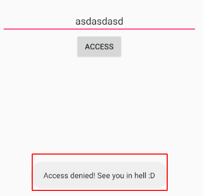

Al buscar el string en el código se obtienen 3 coincidencias, de ellas entro a la clase “HardcodeActivity” ya que es la que más coincide con el nombre del ejercicio.

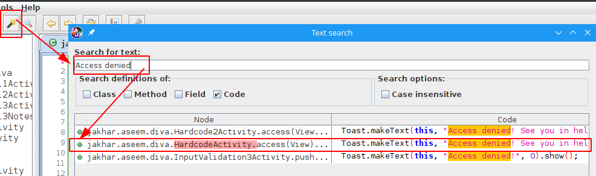

En la función que contiene el string se puede ver claramente la comparación del valor introducido con el string “vendorsecretkey”.

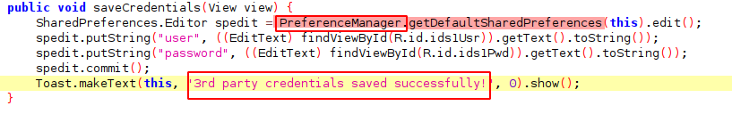

Si probamos el string encontrado en la entrada del ejercicio obtenemos el mensaje correcto.

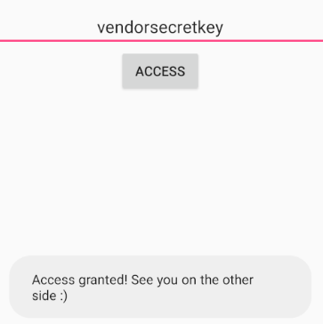

## Insecure Data Storage – Part 1

Empezamos introduciendo una credenciales en el ejercicio:

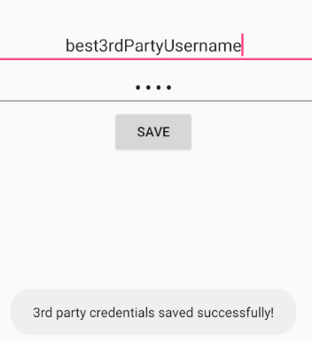

Y vuelvo a buscar el string del mensaje, en este caso me di cuenta que si le das al botón de la varita se abre el buscador con la opción “code”.

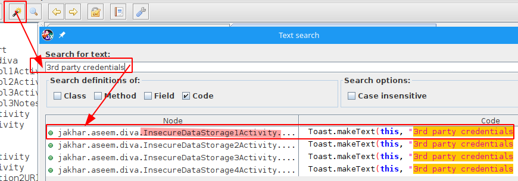

El objeto usado para para almacenar el user y password lo obtiene del “PreferenceManager”.

Buscando en la documentación de Android ví que “Preference” es un XML, solo faltaba saber la ruta que pude averiguar por StackOverflow.

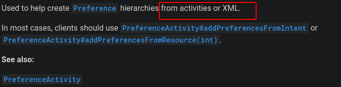

Ejecuto una terminal desde ADB para ver el contenido del archivo donde guarda las credenciales.

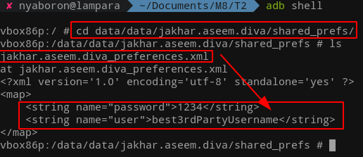

## Insecure Data Storage – Part 2

Repito el mismo proceso, busco el string “3rd party credentials saved succesfully!”

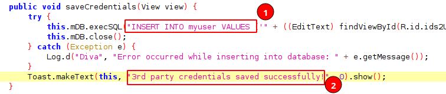

En este caso guarda las credenciales en una base de datos, ahora faltaría saber la ruta y nombre de la base de datos, esta se crea desde la función justo encima **“onCreate()”** con el nombre **“ids2”**.

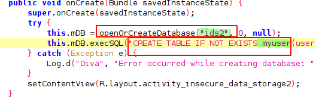

Las bases de datos se guardan por defecto en la ruta **“/data/data/NOMBREDELPAQUETE/databases”**, ejecuto una shell y obtengo el contenido de la base de datos.

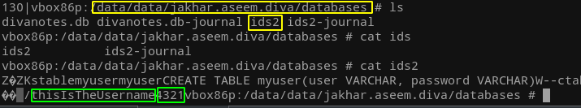

## Insecure Data Storage – Part 3

Repito el mismo proceso, y llego al código correspondiente.
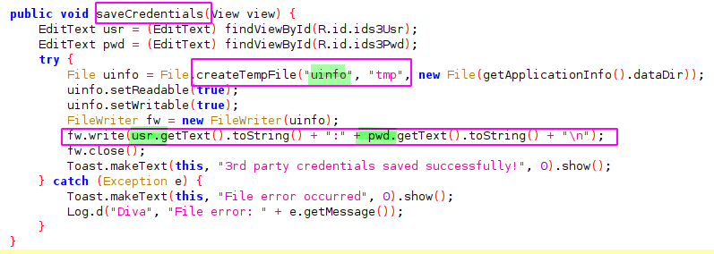

Busco en la documentación la función **createTempFile()** y en esta se indica que los archivos temporales se borran al llamar la función **“deleteOnExit()”** como en el código no se llama el archivo temporal se queda en disco.

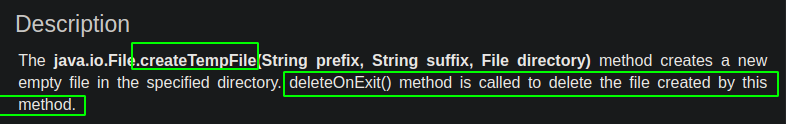

En la ruta **“/data/data”** encontramos el archivo temporal que empieza por el string **“uinfo”**.

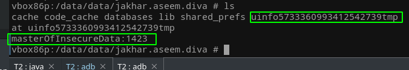