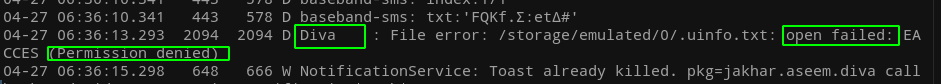
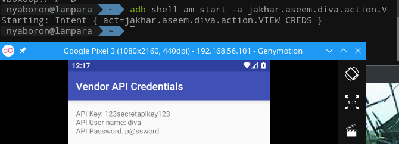

+++
author = "Hugo Authors"
title = "DIVA – Retos 6 al 13 (3/3)"
date = "2021-05-20"
description = "DIVA – Retos 6 al 13 (3/3)"
categories = [
    "Test"
]
tags = [
    "emoji",
]
+++

## Insecure Data Storage – Part 4

Al escribir las credenciales que pide este ejercicio obtenía el mensaje “File error occurred”, al final pude ver desde el log que era por temas de permisos.

Con ir a la información de DIVA y permitir **“Storage”** ya podía continuar.

Ya entrado al código del ejercicio se puede ver que crea un archivo “uinfo” en la raíz de la sdcard, ese archivo guarda las credenciales en texto plano.

Inicio la shell y con el comando cat muestro el contenido de uinfo.

## Input Validation Issues – Part 1

Busco el texto “not found”, hay varias coincidencias pero está claro que es la correspondiente al SQLInjectionActivity.

En el código se ve la sentencia SQL que usa como entrada el texto escrito en el cuadro de texto, el contenido concatenado al SQL no se sanitiza de ninguna forma por lo que se puede escribir el código que quieras controlando la abertura y cierre de las comillas.

## Input Validation Issues – Part 2

Aun mirando el código no conseguí hacerlo sin las soluciones, también leí la documentación del loadURL pero solo nombran las peticiones HTTP y yo no caí en abrir archivos desde el navegador.

## Access Control Issues – Part 1

Mirando el código sí que llegué a la conclusión que el Action de alguna forma hay que iniciarlo “a mano” pero la verdad es que también necesité mirar la solución.

Iniciando la action desde adb.

## Hardcoding Issues – Part 2

En el código se a través de un objeto de la clase DivaJni llama a la función “acces ()” con argumento el texto introducido en la aplicación y comprueba el entero devuelto por  esa función.

Al hacer el Ctrl + clic sobre el objeto el editor nos lleva al archivo de la clase. Esta carga la librería “divajni” haciendo que sin examinar la librería no podamos entender cómo comprueba la contraseña.

Dentro del .apk en la ruta “resources/lib/” está la librería en cuestión para distintas arquitecturas, extraigo la que contiene la carpeta “arm64-v8a”. En un primer intento uso la herramienta “strings arm64-v8a/libdivajni.so” y de la salida obtenida todos correspondian a la secciones del .so, nombre de las dos funciones, el compilador, etc. Por lo que probé con el string que parecía más sospechoso.

En la siguiente captura se puede ver el mensaje de acceso correcto.

## Input Validation Issues – Part 3

En la descripción del ejercicio deja claro que hay que corromper la memoria, si la aplicación consiste en una entrada lo más clásico es conseguir un buffer overflow.

Probando a introducir valores he encontrado tres situaciones:

* Se cierra la vista del lanzamiento con un mensaje de error pero si lo ignoras DIVA sigue funcionando.
* Se cierra la vista sin mostrar ningún mensaje de error.
* La aplicación se para por completo.

Para obtener el código correcto del lanzamiento he abierto la librería dinámica de x86 (porque no me manejo en ARM) con IDA, dentro de la función hace un bucle de 7 iteraciones para comparar el argumento de entrada con el string “.dotdot” que está en memoria.

El string **“.dotdot”** se encontraba consecutivo en memoria a la contraseña del anterior ejercicio. Finalmente se muestra el mensaje de la cuenta atrás.

