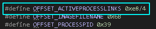

+++
author = "Nyaboron"
title = "Driver para detectar el ataque DKOM"
date = "2021-07-02"
description = ""
categories = [
    "windows"
]
tags = [
    "windows",
]
+++

> Repo con el código: [nyaboronn/detectarDKOM](https://github.com/nyaboronn/detectarDKOM)

## Introducción

A continuación explicaré como he programado una herramienta para detectar procesos (Windows) escondidos con la técnica DKOM mediante un driver. En este caso la detección se hace sobre los procesos que tienen como padre al explorer.exe, los avisos sobre si se detecta o no un hidden process se hacen mediante la salida de debug.

Para el entorno preparé una VM con Windows 10 x86 y el siguiente software:

* [DebugView](https://www.google.com/url?q=https://docs.microsoft.com/en-us/sysinternals/downloads/debugview&sa=D&source=editors&ust=1665127458328917&usg=AOvVaw14i4J9n823yWTHlvVsDdBd)
* [Process Hacker](https://www.google.com/url?q=https://processhacker.sourceforge.io/&sa=D&source=editors&ust=1665127458329341&usg=AOvVaw0FDaV_tEmDcosHa976WU1i)
* [Visual Studio Community](https://www.google.com/url?q=https://visualstudio.microsoft.com/downloads/&sa=D&source=editors&ust=1665127458329755&usg=AOvVaw3y_ncuoNnmDRCKDi_sNxS6)
* [Windows 10 SDK](https://www.google.com/url?q=https://developer.microsoft.com/en-us/windows/downloads/windows-10-sdk/&sa=D&source=editors&ust=1665127458330175&usg=AOvVaw01jyRAVGOvxhu1hCECgLN5)
* [Windows 10 WDK](https://www.google.com/url?q=https://docs.microsoft.com/en-us/windows-hardware/drivers/download-the-wdk&sa=D&source=editors&ust=1665127458330580&usg=AOvVaw35HbTPMU8HMmGZahv3umbr)

## Partes del código y compilación

El proyecto consta de tres partes (proyectos Visual Studio):

  * ***ProcessHide***: driver que recive por un IOCTL el PID a ocultar.
  * ***ProcessHideUserCall***: programa modo usuario para llamar al driver ProcessHide, recive comoentrada un string con el nombre del proceso a ocultar.
  * ***DetectarDKOM***: el driver que detecta el DKOM.

## Acerca de la implementación

El objetivo de este apartado es explicar detalles de la implementación de la herramienta.

### Vista general

Dicho de forma “hablada” el código consiste en controlar los procesos cuyo padre sea el explorer.exe guardando o borrando sus PIDs de una lista, la lista es usada por un thread cada X segundos para saber si un proceso creado no está disponible sin llegarle la notificación de que se ha cerrado. Cuando hablo de lista me refiero a memoria física reservada con ExAllocatePoolWithTag y las notificaciones son el callback PsSetCreateProcessNotifyRoutine.

Visto en forma de esquema la ejecución del driver es:

  1. DriverEntry()
  2. InitializateData()
      - preparar pools para registrar los procesos.
      - obtener el pid del explorer.exe
      - iniciar el thread que busca procesos escondidos.
  3. Registrar el callback PsSetCreateProcessNotifyRoutine.
  4. UnloadFunc()

### Notificar los procesos creados y parados

Googleando encontré la función ***PsSetCreateProcessNotifyRoutineEx*** y que la firma de testeo no sirve con esa rutina, acabé encontrando un artículo que usa distintas versiones de esa función y llegué a la misma pero sin “Ex” al final. La diferencia está que “Ex” permite cancelar el crear un proceso pero como no es algo que necesito para mi implementación con ***PsSetCreateProcessNotifyRoutine*** es suficiente y sin añadir el paso de firmar el driver.

Dado que solo interesan los pid cuyo pid padre sea el del explorer la función que gestiona el callback sirve de filtro.

### Recorrer la lista de procesos

El campo ***ActiveProcessLinks*** dentro de la estructura ***EPROCESS*** apunta al siguiente ActiveProcessLinks y no al inicio de la estructura como pensé en su momento.

Al recorrer la lista me costó unos cuantos reinicios de Windows no restar el offset de la lista para obtener el inicio de la estructura **EPROCESS**.

El código mostrado anteriormente corresponde a la búsqueda de un EPROCESS con nombre de imagen dada por parámetro del cual se guarda el PID. Además lo junté con el mal uso de los offsets, cómo pregunté por Telegram faltaba dividir el offset entre el tamaño de palabra.

### Registro de los procesos creados y parados

Para gestionar los PIDs **uso dos pools**, una que almacena los pids (**poolPids**) y la segunda para indicar si una posición almacena un valor (**poolFlags**).

Al notificarse el guardar un PID, el flag correspondiente **se establece a 1 para indicar que está en uso**. Al principio en mi cabeza todo tenía sentido para enfocarlos a registrar todos los procesos e intentar que fuese más rápido con operaciones de bitwise pero me lié con otra parte del código y esto se quedó en algo que funciona pero es dar vueltas innecesarias.

El número de IDs a controlar son máximo 8, y las pools se reservan en las siguientes líneas.

### Thread para el scheduler que realiza la detección

La función **PsCreateSystemThread** crea threads en modo kernel y devuelve un manejador, el último valor es un parámetro llamado Contexto, que se le puede pasar como argumento a la función que ejecuta el thread.

Dentro de la función ejecuto un bucle infinito que se pausa en intervalos de 3 segundos [5] con la función KeDelayExecution(). Si el delay se ha podido hacer entonces se llama a la función que compara la lista de pids con la de procesos del sistema. La variable global “kill” se establece a TRUE en el Unloader del driver y hace un break al bucle infinito.

## Ejemplo de uso con notepad.exe

Teniendo **DbgView** abierto creo e inicio los drivers de ProcessHide y DetectarDKOM.

En la salida de debug se ven los avisos de la carga y el PID del explorer.exe obtenido. Además el inicio del bucle infinito del thread se muestra justo de seguido:

Si esperamos el tiempo de delay del thread se muestra el mensaje de la primera iteración del bucle:

A continuación abro el notepad.exe que será el proceso a ocultar:

En la salida de debug se recibe la notificación que **un proceso con PID 2052 se ha creado y se guarda en la pool**.

Si cierro el notepad también se recibe la notificación.

Ahora falta la parte más interesante, la que muestra el resultado final, oculto el proceso del notepad con el programa.

Finalmente sale el objetivo buscado, ProcessHide indica que ha recibido un PID (como cerré el notepad el PID es diferente para esta captura), y un poco más adelante la Tarea1 indica que termina el delay y ha encontrado el 1532 escondido.

## Bibliografía y recursos

  - [https://en.wikipedia.org/wiki/Direct_kernel_object_manipulation](https://en.wikipedia.org/wiki/Direct_kernel_object_manipulation)
  - [hasherezade/setup#prepare-the-vm](https://www.google.com/url?q=https://github.com/hasherezade/malware_training_vol1/tree/main/exercises/setup%23prepare-the-vm&sa=D&source=editors&ust=1665127458352011&usg=AOvVaw1cOgUEyRXHhxnA0BpcYXaj)
  - [https://stackoverflow.com/questions/64197518/device-driver-does-not-install-on-any-devices-use-primitive-driver-if-this-is-i](https://stackoverflow.com/questions/64197518/device-driver-does-not-install-on-any-devices-use-primitive-driver-if-this-is-i)
  - [https://www.ired.team/miscellaneous-reversing-forensics/windows-kernel-internals/subscribing-to-process-creation-thread-creation-and-image-load-notifications-from-a-kernel-driver#pssetcreateprocessnotifyroutine](https://www.ired.team/miscellaneous-reversing-forensics/windows-kernel-internals/subscribing-to-process-creation-thread-creation-and-image-load-notifications-from-a-kernel-driver#pssetcreateprocessnotifyroutine)
  - [https://www.codeproject.com/Questions/631671/Windows-Sleep-in-kernel-driver](https://www.codeproject.com/Questions/631671/Windows-Sleep-in-kernel-driver)