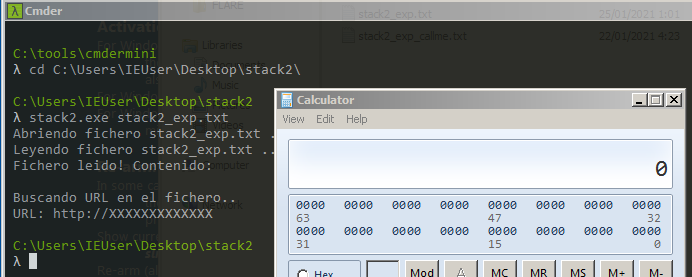

+++
author = "Hugo Authors"
title = "Easy peasy Stack Overflow"
date = "2021-02-19"
description = "Easy peasy Stack Overflow"
categories = [
    "Test"
]
tags = [
    "emoji",
]
+++


La idea es aprender a detectar y explotar la vulnerabilida stackoverflow en el caso más sencillo, con la mitigación Data Execution Prevention desactivada y teniendo el código fuente. El objetivo es solucionar el ejercicio de dos formas, primero redirigir el flujo a la función «call_me» y segundo redirigir la ejecucion hacia una shellcode dada por como entrada la cual lance la calculadora de Windows.

> Enlace al [código fuente y versión compilada.](files/code_and_solution.zip)

## Introducción

Para buscar la vulnerabilidad inicialmente hago un análisis estático con **IDA**, con este encuentro el código que permite el stack overflow, a continuación depuro el binario con **Immunity Debugger** para verificar el análisis estático y hago uso del módulo **mona** que **facilita el cálculo del número Bytes necesarios para sobreescribir el valor de retorno.** Finalmente muestro los exploits programados para llamar a la función call_me y la ejecución de un shellcode que inicia la calculadora de windows. 

## Análisis estático

Una vez abierto el binario con IDA compruebo si ha encontrado strings.


Con un vistazo rápido a las referencias cruzadas compruebo que el string marcado en la imágen anterior corresponde al main, el resto son usados dentro de una misma función. Para comprobar la referencias cruzadas a los strings voy a la vista en texto del código.


Teniendo seleccionado el string pulso ‘X’ para mostrar las referencias cruzadas.


La función donde es usado el string vista como un grafo es la siguiente.


Para explicar el análisis me ha parecido mejor hacerlo en base al resultado final tras renombrar las variables y añadir colores, de esta forma creo que se hará menos tedioso al no ir mostrando variable por variable como las renombro.


La función fopen devuelve un puntero a una estructura del tipo File, si este es nulo el fichero no se ha podido abrir. Por tanto en este momento ya podemos renombrar las variables como “filename” al argumento y “var_file_ptr” al FILE* devuelto por fopen.


La captura del prototipo de la función fopen (y las siguientes) es de la web cplusplus.com. Ahora es donde el código difiere del Stack1.


Primero hace uso de la función fread, comprobando sus argumentos ya identificamos el buffer donde almacena lo leído del fichero y el tamaño de 512B del buffer, por tanto renombro las variables a “buffer_fichero” y “size”.


Luego encontramos la función strstr, esta busca el string dado como segundo argumento en el string dado en el primer argumento. La variable usada para almacenar el puntero al inicio del substring la renombro “ptr_substr”. Con esto ya sabemos que para la ejecución dinámica se necesita pasar como argumento un fichero que contenga como mínimo la cadena “http”.


Para acabar, el último nodo se encarga de copiar la url encontrada en una variable, además imprime el valor de la url y cierra el fichero.


La función memcpy copia “num” bytes del buffer pasado como segundo parámetro al buffer pasado como primer parámetro sin tener en cuenta el carácter ‘\0’. Por  tanto si no se controlan el número de bytes copiados y los sizes de los buffers estamos ante un posible stack overflow.


El buffer de la variable destino “buffer_url” no ha sido usado hasta ahora, su size son 16B. Dado que memcpy copiará 254 “num” bytes se está copiando más datos de los reservados para el buffer de la url.


La stack quedaría de la siguiente forma:


La distancia entre el buffer_url y el eip a sobreescribir no llega a los 40h por lo que es viable explotar este stack overflow ya que se copian 100h.

## Análisis dinámico

Una vez abierto el binario Stack2 situo el código a analizar buscando los strings.


En cuanto al fichero de entrada el pattern lo genero con mona, al inicio del fichero de entrada añado el string “http://” para que pueda usar directamente el byte que me indique.


Pongo un breakpoint con ‘F2’ en el fclose y eax contiene parte del pattern y que se ha sobreescrito la dirección de memoria del FILE*.


Ejecuto “!mona findsmp” para obtener la posición, en el Byte 13 del pattern empieza la dirección de memoria del fichero.


A continuación pongo a null el valor del FILE* para que fclose no pare la ejecución del programa por la dirección de memoria sobreescrita y ejecuto hasta el RET para que recupere de la stack el valor de eip sobreescrito.

Ejecuto de nuevo “!mona findsmp” y obtengo que eip se encuentra en el byte 29 del pattern.


## Llamar la función call_me

El exploit va precedido de la cadena “http://”, la dirección del fichero empieza (sin tener en cuenta el string inicial) en el Byte 13 y eip en el Byte 29.

```python
call_me = 0x401530
f = open('Stack2_exp.txt', 'wb')
 
payload = "http://"
payload += 13*'X' # relleno
payload += struct.pack("<I", 0x0)  # FILE* a null
payload += 8*'X' # relleno
payload += 4*'A' # ebp
payload += struct.pack("<I", call_me) #eip
 
f.write(payload)
f.close()
```

Una vez introducida la payload compruebo en el depurador que pase la función fclose y que la dirección de retorno sea la del call_me.


## Ejecutar una shellcode

El código de la shellcode lo guardo en la pila, a continuación de la dirección de retorno pongo una lista de NOPs y la shellcode.

```python
call_shellcode = 0x22FEB0
"\x89\xe5\x83\xec\x20\x31\xdb\x64\x8b\x5b\x30\x8b\x5b\x0c\x8b\x5b\x1c\xx1b..."
payload = "http://"
payload += 13*'X' # relleno
payload += struct.pack("<I", 0x0)  # FILE* a null
payload += 8*'X' # relleno
payload += 4*'A' # ebp
payload += struct.pack("<I", call_shellcode) #eip
payload += 9*'\x90' #NOPs
payload += calc_shellcode
```

En las siguientes imágenes se puede ver la dirección a la shellcode antes de realizar el salto y la rista de NOPs antes de la shellcode.


Finalmente ejecuto Stack desde la terminal

