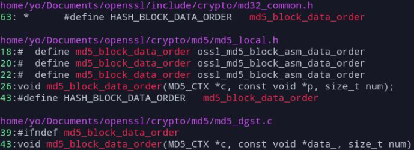
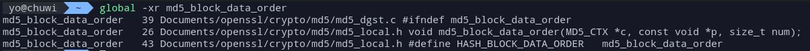
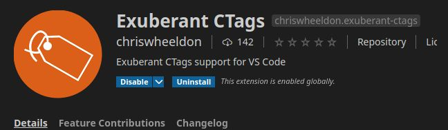
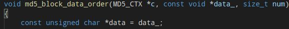
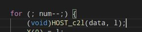
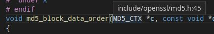
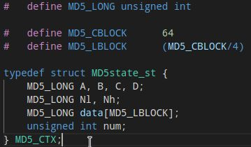
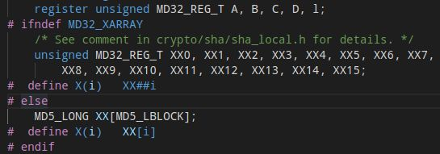
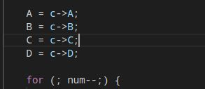
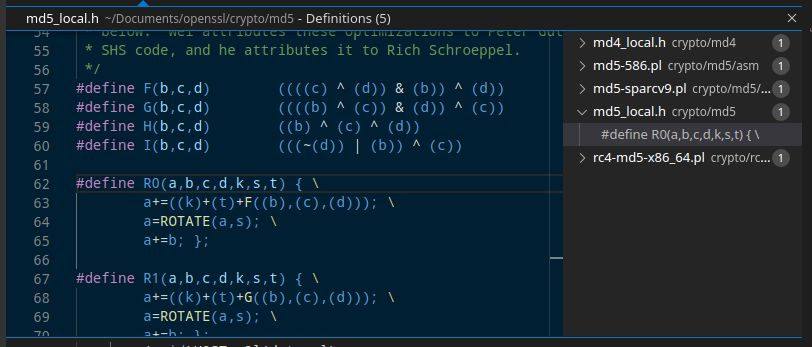

En esta entrada resolveré un reto relacionado con leer código e intentar averiguar su funcionamiento.

## Situación

El siguiente reto emula que un compañero ha identificado un bloque de código en ensamblador que corresponde con la siguiente función:


```markdown
    void md5_block_data_order(MD5_CTX *c, const void *data_, size_t num)
```

El objetivo es localizar la librería, analizar la signatura de la función y explicar el rol que toman los parámetros dentro de la función.

## Buscar la librería y preparar el editor de código

Para buscar la función md5_block_data_order dado que no dispongo de más información que el nombre uso ripgrep desde el directorio raíz para buscar cualquier coincidencia con el nombre de la función. La salida obtenida es:




Al parecer se trata de una función de OpenSSL definida en el archivo md5_local.h. La salida del comando ripgrep daba muchos mensajes de error por problemas con los permisos, así que redirijo la salida de error a un archivo distinto para que ver de forma fácil el resultado. Teniendo en cuenta lo comentado también probé con global generando previamente la base de datos con gtags. La salida confirma lo obtenido con ripgrep:



A continuación preparo un editor de texto con soporte para ctags. En este caso es el Visual Studio Code con la extensión Exuberant CTags.



Para hacerla funcionar hay que generar a mano la base de datos con el comando: 


```markdown
    ctags -R 
```

esta no genera los ctags automáticamente pero en este caso es más que suficiente.


## Analizar el código

La función recibe tres argumentos, el segundo trata de un puntero a void que posteriormente se almacena de nuevo en un puntero de tipo char por lo que se deduce que es un string:



El tercer argumento es un integer usado como iterador en un bucle cuyo interior se realizan una serie de cálculos:



El primer argumento es un puntero a un tipo desconocido, para ir a su definición hago uso de la extensión instalada anteriormente, tal como indica la extensión, se encuentra en el archivo *md5.h línea 45*.



Una vez entrado en md5.h se puede ver que el tipo MD5_CTX es un define de un struct.



La estructura está formada por otros tipos a su vez desconocidos que se encuentran definidos justo antes del struct, por lo que tenemos una estructura con variables del tipo unsigned int y un array de longitud 64/4. Continuo leyendo la función, antes de empezar con el bucle que calcula el MD5 se declara nuna serie de variables.



El tipo MD32_REG_T es un define al tipo int situado en md32_common.h línea 253. A continuación se define una ristra de variables, por optimización no crea un array, para que el uso de estas variables no sea engorroso define una macro cuyo argumento “i” concatenado a los caracteres “XX” permita usar las variables como si tratasen de un array. En cualquier caso lo comentado anteriormente solo se realiza si no está definido MD32_XARRAY.



Luego se copian valores del struct pasado por argumento a las variables locales instanciadas anteriormente y ya entraríamos al bucle. Dentro del bucle se usan muchas veces las funciones R0, R1, R2, R3 y HOST-c2l, estas no son funciones sino macros parametrizadas, lo que viene a ser código que el linker copiará y pegará por cada llamada. Dentro de estas funciones se realizan las operaciones matemáticas que calculan el MD5, el caso de R0 es código es:



Para acabar una iteración del bucle actualiza las variables locales A, B, C, D y al terminar el bucle sale de la función sin devolver un valor como se indica en la signatura void.

En resumen, la función parecer calcular el MD5 haciendo uso de la estructura dada por parámetro para almacenar el resultado obtenido