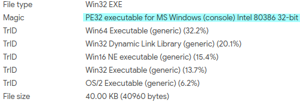
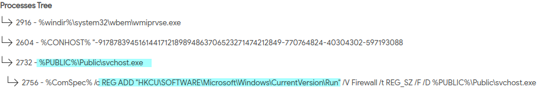
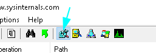

+++
author = "Hugo Authors"
title = "Reversing estático y dinámico de un keylogger (1/2)"
date = "2021-04-05"
description = ""
categories = [
    "reversing"
]
tags = [
    "reversing",
]
+++

Esta entrada consiste en hacer reversing de un lab que trata de un keylogger, pero con la idea de llevar una metología y tener como resultado un documento algo más profesional por decirlo de alguna forma. La muestra no es nada compleja ya que no tiene protecciones (ante depuradores máquinas virtuales, …) y no es necesario reversear algún protocolo red pero es una buena práctica. 

La estructura de la explicación es la siguiente:

- Preparar el entorno
- Reversing básico estático
- Reversing básico dinámico
- Reversing avanzado estático
- Reversing avanzado dinámico

El análisis básico trata de usar herramientas automatizadas para obtener la mayor información posible conociendo si está empacada, buscar strings de interés, revisar librerías (imports) y métodos usados en el código. Mientras el avanzado consiste en usar los depuradores con la información obtenida para ser más eficientes y no perderse por el código ensamblador.

## Preparar el entorno

## Preparar la VM

En primer lugar hay que preparar un entorno seguro para analizar el malware. En este caso Windows 10 en VirtualBox con el Extension Pack instalado.

Descargar la versión de Windows 10 de testeo desde el siguiente enlace (en mi caso la de 64 bits) y descomprimir el zip. Después importar el .ova desde “File -> Import Appliance”.

Antes de empezar con Windows y las herramientas faltan varias opciones a configurar. En las settings de la VM cambiar “Display -> Graphics Controller” a VBoxSVGA. Los valores de CPU y RAM irán acordes al hardware del host.

Desde “File -> Virtual Media Manager” seleccionar la VM y ampliar el size (los 40 GB por defecto son suficientes para las prácticas pero a la que se instale Visual Studio, Python, SDKs y el Driver Kit quedas sin espacio, por ello se amplía a  hasta 80 GB).

Dentro de Windows extender el volumen original de 40 GB en “Inicio -> Buscar -> Create and Format hard disk partitions”.

Con la VM iniciada instalar el Guest Additions “Devices -> Insert Guest Additions Devices”, en caso de ser necesario añadir manualmente la iso descargada a “Storage Devices”.

Después de reiniciar la VM se pueden instalar las actualizaciones y hacer una SnapShot (en mi caso prefiero esperar a configurar Windows y borrar el bloatware ya que la SnapShot ocupa bastante memoria).

### Configurar Windows

Windows ocupa y consume bastantes recursos, por ello para hacer más fluida la VM hay que hacer alguna configuración y borrar el bloatware. Los pasos a seguir son:

**1. Borrar aplicaciones y deshabilitar aplicaciones de inicio.**

* 3D Viewer
* Feedback Hub
* Groove Music
* Microsoft News
* Microsoft One Drive
* Microsoft Silverlight
* Microsoft To Do
* Microsoft Whiteboard
* Juegos (Solitario, Buscaminas, …)
* Lo relacionado con Xbox y realidad virtual
* Paint 3D
* Sticky Notes
* Puppet

En inicio buscar “Task Manager”, en la pestaña “StartUp” deshabilitar todas las aplicaciones menos VirtualBox Guest Additions.

Buscar “View Advanced system settings -> Advanced”, abrir “Settings” y seleccionar el recuadro “Adjust for best performance”.

Para las transparencias buscar en inicio “Color Settings” y poner a Off la opción “Transparency effects”

Otros cambios en «Windows Settings»

* Background Apps
    * Let apps run in the background -> Off
* “Privacy -> General”
    * Todas las opciones -> Off
* Diagnostics & feedback
    * Diagnostic data -> Basic
    Resto de opciones -> Off
* “Privacy -> App permissions”
    * Location -> Off
    * Camera -> Off
    * Microphone -> Off

Para desactivar el firewall en inicio “Windows Defender Firewall” y en el menú a la izquierda entrar en “Turn Windows Defender Firewall On or Off” para marcar los dos “Turn off”.

En cuanto a Windows Defender Antivirus en inicio buscar “Virus & Thread protection” y entrado en “Manage settings” poner las tres opciones a Off. En caso de no querer desactivar el antivirus se pueden excluir directorios, una vez que el malware es ejecutado se tendrá que indicar al antivirus que no ponga en cuarentena el archivo. Los cambios se pierden al reiniciar por ello buscar la cadena “gpedit.msc”. Editar la situada en la ruta “Computer Configuration -> Administrative Templates -> Windows Components -> Windows Defender Antivirus -> Turn off Windows Defender Antivirus”.

Como último paso, la lista de aplicaciones a instalar (es más sencillo administrar la VM si se instalan en la misma carpeta):

* OllyDbg
* PEstudio
* Process Hacker 2
* Procmon
* Detect It Easy
* IDA Pro

Con una snapshot se guarda todo lo configurado e instalado.

## Reversing básico estático

### Análisis en VirusTotal

La búsqueda en Virus Total del hash calculado con sha256 indica que la muestra ha sido analizada el 2021-05-15 18:37:05.

En la lista de antivirus siete lo han marcado como malware siendo en tres de ellos del tipo Troyano.

Está compilado para la arquitectura Intel de 32 bits y sistema operativo Windows, en cuanto a la frescura de la muestra esta ha sido analizada una vez.

En la lista de procesos se lista uno que añade un registro para svhost.exe que parece ser un archivo malicioso encontrado en la ruta %PUBLIC%\Public\svchost.exe. Se ejecuta un comando de sistema que añade la clave de registro “HKCU\SOFTWARE\Microsoft\CurrentVersion\Run” /V

### Análisis del empacado

Tras abrir la muestra con Exeinfo PE indica que se trata de una aplicación de 32 bits compilada con Microsoft Visual C++ 2020 y no está empacada.

Desde la aplicación Detect It Easy indica que el timeStamp es “2020-10-08 09:09:37” y trata de una aplicación de consola.

Respecto a la entropía die establece un 77%, no está empacado. En la columna “Status” para cada sección del PE indica que no están empacadas. Desde la vista de los strings la gran mayoría son legibles.

### Análisis de las librerías

Usando pestudio en la pestaña “libraries” se listan once, la librería gráfica “gdi32.dll” puede indicar la toma de capturas de pantalla y el tratamiento de imágenes.

Ordenada la tabla de imports por la columna “blacklist” se encuentran siguientes librerías:

* Finalizar procesos: GetCurrentProcessId, GetCurrentThreadId y TerminateProcess
* Ejecutar comandos de shell: system
* Detectar pulsaciones de teclas: GetAsyncKeyState
* Carga dinámica de librerías: GetModuleFileNameW

En relación a los imports no marcados en la lista negra:

* C y C++: memcpy, ostream, fclose/fread/fwrite, …
* Anti debug:
    * IsDebuggerPresent
    * FindWindowA
    * GetCurrentProcess
* Exceptions:
    * SetUnhadleExceptionFilter
    * UnhandledExceptionFilter
* Manejo de directorios y archivos:
    * reateFileA, WriteFile, CopyFileW y SetFilePointer (kernel32.dll)
    * _mkdir (api-ms-win-crt-filesystem-l1-1-0.dll)
* Funciones gráficas (gdi32.dll)
    * CreateCompatibleBitMap
    * CreateCompatibleDC
    * BitBlt
* Otros
    * IsProcessorFeaturePresent

### Cadenas de texto interesantes

Entre las cadenas de texto marcadas en la blacklist destacan:

* Ruta raíz de los artefactos usados por el malware
    * C:\Users\Public
* Screenshots
    * C:\Users\Public\Screens
    * C:\Users\Public
    * C:\Users\Public\Screens\screenshot
    * C:\Users\Public\Screens\screenshot.bmp
* KeyLogs
    * C:\Users\Public\Public\keylogs.txt
* Ejecutable
    * C:\Users\Public\Public\svchost.exe
* Persistencia
    * “HKCU\SOFTWARE\Microsoft\CurrentVersion\Run” /V

En los strings no clasificados se encuentran lo que parecen ser la lista de teclas a comprobar si se han pulsado, entre ellas no se listan las letras del alfabeto ni los números.

Teclas listadas en los strings:

* Generales: Enter, Space, BackSpace
* Ratón: Right click, Left click
* Flechas: up, down, left, right
* Meta: Tab, Escape, control (l & r), shift (l & r)
* Fn: F1 a F12
* Otras: end, home, page up, page down, numlock, delete

## Reversing básico dinámico

### Análisis automático (Sandbox)

En Cuckoo la ha marcado con una relevancia 10/10 destacan las reglas YARA para el keylogger, screenshots y el isDebuggerPresent.

En **Hybrid Analysis** la detección de los 520 slept times y los hooks a diferentes funciones de la librería SSPICLI.dll.

### Análisis en la VM con herramientas de telemetría

Tras abrir procmon y posteriormente ejecutar la muestra los resultados se filtran por proceso desde “Filter -> Filter…”, opción “Process Name” en el primer desplegable, seleccionar el proceso con el nombre del ejecutable (MASTER_Malware_Lab1.exe) y hacer clic a “Apply” para añadir el filtro.

Desde la barra de herramientas seleccionar el icono “cubo en desintegración” para mostrar los eventos relacionados con claves de registro.

La ristra es tediosa de leer, se pueden destacar los relacionados con la clave listada desde VirusTotal “HKCU\SOFTWARE\Microsoft\CurrentVersion\Run”. Buscar una entrada cuyo Path sea “HKCU” y después “Clic derecho -> Highlight -> Path”.

El evento no aparece en la lista porque la clave es creada ejecutando un comando en una shell y no con la WinAPI. Seleccionar el siguie nte botón para filtrar por la telemetría de procesos:

En la siguiente imágen se muestra el proceso de la cmd con el comando de registro ejecutado.

Seleccionar el siguiente botón para filtrar por archivos:

Durante el análisis estático se obtuvieron posibles rutas donde el malware guarde los artefactos generados, estas se confirman en los eventos registrados para el keylogger y las capturas bmp.

Finalmente falta ir a la rutas de los artefactos y de la clave de persistencia.

El registro “firewall” apunta al ejecutable svhost.exe situado en la carpeta “Public”.

