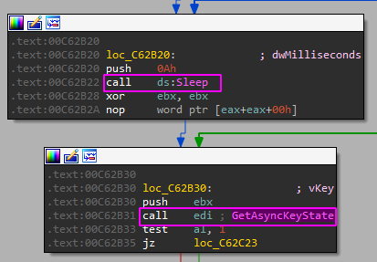
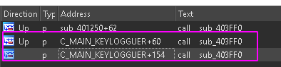
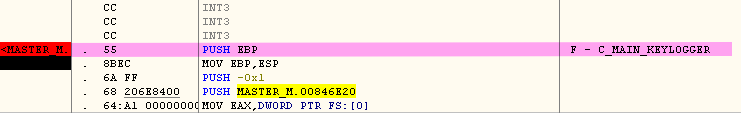

+++
author = "Nyaboron"
title = "Reversing estático y dinámico de un keylogger (2/2)"
date = "2021-04-05"
description = ""
categories = [
    "reversing"
]
tags = [
    "reversing",
]
+++

Tras el análsis básico se han obtenido una serie de IoC, los strings e imports a identificar en el análsis avanzado son:

| system                    | GetAsyncKeyState | GetModuleFileNameW | isDebuggerPresent      |
|---------------------------|------------------|--------------------|------------------------|
| IsProcessorFeaturePresent | FindWindowA      | ShowWindow         | CopyFileW              |
| CreateFileA               | SetFilePointer   | WriteFile          | CreateCompatibleBitMap |
| CreateCompatibleDC        | BitBlt           | _mkdir             | GetCurrentProcessId    |
| GetCurrentThreadId        | TerminateProcess |                    |                        |

Strings a identificar

* C:\Users\Public
* C:\Users\Public\Screens
* C:\Users\Public\Screens\screenshot
* C:\Users\Public\Screens\screenshot.bmp
* C:\Users\Public\Public\keylogs.txt
* C:\Users\Public\Public\svchost.exe
* REG ADD “HKCU\SOFTWARE\Microsoft\CurrentVersion\Run” /V

## Identificar los Imports

En las situaciones donde varios imports se han identificado en una misma función los he agrupado. La codificación utilizada para renombrar las funciones consiste en:

* Empezar con la cadena “C_” (C = custom, esto permite poder verlas juntas en el listado de funciones del IDA).
* “MAIN_” si es llamada por el main.
* Nombre de la función.

### isDebuggerPresent y IsProcessorFeaturePresent

Buscar “isDebuggerPresent” en los imports y hacer doble clic en la fila para ir al desamblado.

Obtener las referencias cruzadas ya sea mirando las que lista IDA justo debajo con comentarios o pulsando la letra ‘X’ teniendo seleccionada la función.

En la función al principio llama a IsProcessorFeaturePresent, si devuelve cero termina la ejecución.

En caso de seguir la ejecución usa isDebuggerPresent.

Dado que la función se usa para comprobar si determinadas características están en la CPU y si es depurado la renombro a C_CHECKFEATURESANDDEBUGGER.

### FindWindowA y ShowWindow**

Se usan el para ocultar/mostrar la ventana con la clase “ConsoleWindowClass”. Alrededor de esta función se encuentran strings e imports de interés que se explicarán más adelante.

### GetAsyncKeyState y Sleep**

GetAsyncKeyState es usada por una función y es llamada después de realizar un Sleep, de esta forma da tiempo a poder registrar pulsaciones.

El resto del código parece preparar un buffer usando librerías de C++, en la siguiente sección se encuentra un fclose.

Hay una referencia cruzada desde el main.

Teniendo en cuenta la lectura de las pulsaciones, el uso de fclose y su llamada desde el main renombro la función a C_MAIN_KEYLOGGUER.

### system**

Hay una llamada a system y antes de ejecutarlo se encuentra el string con el comando “REG ADD”.

La función que contiene a system se llama desde el main, y va a continuación del findWindowA mostrado anteriormente.

Dado que realiza la persistencia de la muestra y es llamada desde main, renombro la función a C_MAIN_PERSISTENCIA.

### CopyFileW**

Es llamada una vez desde el main, como argumento se da la ruta al malware para realizar la copia del binario.

### _mkdir**

También desde el main, se usa en varias ocasiones para crear las rutas donde guardar el binario y capturas.

### CreateFileA, SetFilePointer, WriteFile, CreateCompatibleBitMap, CreateCompatibleDC, BitBlt**

Al buscar las xrefs de CreateFileA lleva a una función que hace uso de todas las funciones listadas en este punto.

La función aparenta compleja pero es bastante lineal y realiza varias operaciones relacionadas con archivos. Esta solo tiene una xref desde otra función. Dado que parece tratar las capturas se renombra a C_SCREENSHOT.

La función que llama a C_SCREENSHOT es muy corta, parece ser una función intermedia que prepara algunas variables.

Al obtener las xrefs se lista una desde main, por ello la renombro a C_MAIN_SCREENSHOT. Más adelante se revisa la referencia restante.

En main se encuentra entre la función de persistencia y la del keylogger.

En cuanto a la xref restante, el código es parecido al de C_SCREENSHOT pero al principio se encuentra el path a las capturas y también es usada desde main.

A su vez el código con el path es llamado desde el main.

Dado que C_MAIN_SCREENSHOT es llamada tanto de main como desde esta última función y tienen código parecido de momento la nombraré como C_MAIN_SCREENSHOT_WITH_PATH. La llamada a C_MAIN_SCREENSHOT_WITH_PATH está después de C_MAIN_KEYLOGGUER, se intenta crear un thread.

El siguiente diagrama representa la anterior relación entre las funciones:

## Identificar los Strings

Algunos de los strings ya se han visto en la sección de las librerías:

### C:\Users\Public, C:\Users\Public\Screens**

En main con _mkdir para crear los directorios.

### C:\Users\Public\Screens\screenshot**

En C_MAIN_SCREENSHOT_WITH_PATH.

### REG ADD “HKCU\SOFTWARE\Microsoft\CurrentVersion\Run” /V**

En C_MAIN_PERSISTENCIA.

### C:\Users\Public\Public\svchost.exe**

Como argumento para CopyFileW en main

Respecto al resto de de cadenas:

### C:\Users\Public\Public\\screenshot.bmp**

Argumento para una función de la que desconozco el uso, es llamada muchas veces y parece sanitizar o parsear los strings.

### Cualquiera de los strings que representan una tecla**

Llevan a un switch con cada string de las teclas.

En las xrefs se lista la función principal del keylogger, por tanto se renombra a  C_KEYLOGGER_SWITCH.

### C:\Users\Public\Public\keylogs.txt**

Usada en una función que hace distintas comprobaciones sobre el fichero (ver si está creado, inicializarlo, comprobar errores, etc)

Es llamada desde la función principal del keylogger y lo renombro a C_KEYLOGGER_TXT_BUFFER.

Como resultado final la lista de funciones vistas desde IDA es:

## Reversing avanzado dinámico

Tras abrir la muestra con OllyDbg y recalcular en IDA las direcciones de memoria a la base de la imagen desde la opción “Edit -> Segments -> Rebase Program”, los breakpoints y correspondientes comentarios quedan:

La primera función en ejecutarse es MAIN_PERSISTENCIA y tras depurar paso a paso llega al string con el comando que realizará la persistencia.

Al ejecutar el RETN se ven las funciones listadas en el main. Donde la siguiente función a ejecutar es MAIN_SCREENSHOT y después los correspondientes threads para MAIN_KEYLOGGER y MAIN_SCREENSHOT_WITH_PATH.

Antes de ejecutar MAIN_SCREENSHOT entre los argumentos se encuentra el string para “screenshot.bmp” y al continuar depurando dentro de la función llega el call a SCREENSHOT.

La función SCREENSHOT usa CreateFileA con el string dado como argumento desde MAIN_SCREENSHOT. Al revisar la carpeta “Screens” se encuentra el archivo de 0 Bytes.

Pulso F9 para seguir la ejecución y para en MAIN_KEYLOGGER.

Esta función destaca por la llamada a KEYLOGGER_TXT_BUFFER porque es la encargada de gestionar el archivo keylogs.txt y por la capturas de las pulsaciones.

Tras el return de KEYLOGGER_TXT_BUFFER se ejecutarán la capturas de las teclas y el sleep vistos en IDA.

Para acabar debajo de la llamada del segundo GetAsyncKeyState se usa la función KEYLOGGER_SWITCH.

Desde el explorador de archivos se vé el txt con 0 Bytes y si al seguir depurando se mantiene F9 para continuar se registrará la tecla. En caso de no pulsar teclas se pausa la ejecución en el breakpoint del screenshot.

